# Plan de Estudios (Syllabus): Teoría de la Computación y Sistemas Supervisados
**Duración:** 14 Semanas (1 Semestre)  
**Objetivo General:** Que los estudiantes comprendan los formalismos de la Teoría de la Computación (lenguajes, autómatas y computabilidad) y los apliquen para modelar, validar y supervisar flujos de trabajo (workflows) de negocio y producción mediante Sistemas de Eventos Discretos (DES). Al finalizar el semestre, los estudiantes construirán un motor intérprete y un supervisor automático que prevenga bloqueos operacionales en tiempo real.

---

## Estructura Semestral y Contenido

```mermaid
gantt
    title Cronograma Curricular y Hitos del Proyecto
    dateFormat  X
    axisFormat %d
    
    section Bloque 1: Fundamentos
    Semanas 1-3: Computación & Dinámica       :active, 0, 3
    
    section Bloque 2: Autómatas Finitos
    Semanas 4-6: FSA y Cintas                 : 3, 6
    Hito 1: Motor FSA Local (Sem. 6)          :milestone, 5, 1
    
    section Bloque 3: Memoria de Pila
    Semanas 7-9: PDA y Recursión              : 6, 9
    Hito 2: Motor PDA (Sem. 9)                :milestone, 8, 1
    
    section Bloque 4: Concurrencia
    Semanas 10-12: Sistemas Comunicantes     : 9, 12
    Hito 3: Red de Procesos (Sem. 12)         :milestone, 11, 1
    
    section Bloque 5: Control Supervisor
    Semanas 13-14: Supervisión & Entrega      : 12, 14
    Hito 4: Entrega Final (Sem. 14)           :milestone, 13, 1
```

---

### Bloque 1: Computación Combinatoria e Introducción a Sistemas (Semanas 1-3)

*   **Semana 1: Introducción a la Computación Sistémica**
    *   *Teoría:* Qué es la Teoría de la Computación. Computación Combinatoria (sistemas sin memoria). Ecuación estática \(y(t) = f(x(t))\).
    *   *Práctica:* Análisis de compuertas lógicas y cálculos lineales inmediatos en código (multiplicación de escala, transformaciones lineales de datos).
*   **Semana 2: Dinámica de Sistemas y Eventos Discretos (DES)**
    *   *Teoría:* El concepto de Estado de Memoria. Sistemas Dinámicos Continuos vs. Discretos. ¿Por qué una organización (empresa, fábrica) se modela mejor como un DES?
    *   *Práctica:* Simulación básica en consola del ciclo de vida de un recurso con variables de estado discreto.
*   **Semana 3: Reglas de Producción, BNF y Sintaxis de Procesos**
    *   *Teoría:* Gramáticas formales y reglas de producción. Notación Backus-Naur Form (BNF). Uso de BNF para describir la sintaxis de un workflow operativo en lugar de un lenguaje de programación.
    *   *Práctica:* Diseñar la gramática BNF de un proceso de facturación y aprobación de compras.

---

### Bloque 2: Autómatas de Estados Finitos y Modelado Local (Semanas 4-6)

*   **Semana 4: Autómatas Finitos Deterministas (DFA)**
    *   *Teoría:* La 5-tupla formal. Diagramas de transición y tablas de estado. El estado como resumen histórico de eventos.
    *   *Práctica:* Diseño en papel y grafos de un DFA que reconozca secuencias de operación en un cajero automático o validador de tarjetas.
*   **Semana 5: Lenguajes Regulares y Crecimiento de Cadenas**
    *   *Teoría:* Gramáticas regulares lineales a la derecha/izquierda. Cinta de entrada y crecimiento del lenguaje procesado.
    *   *Práctica:* Implementación manual en código de la lógica de transiciones de un DFA básico para validar cadenas binarias.
*   **Semana 6: Hito del Proyecto - Motor FSA Local**
    *   *Teoría:* Serialización de autómatas. Representación de grafos mediante estructuras de datos (matrices de adyacencia vs. diccionarios).
    *   *Hito de Laboratorio (Entregable 1):* Construir el cargador de archivos JSON que describa un DFA y el motor que evalúe paso a paso una cinta de caracteres de entrada.

---

### Bloque 3: Memoria Estructurada y Límites del Cómputo (Semanas 7-9)

*   **Semana 7: La Limitación de los FSA y la Necesidad de Contar**
    *   *Teoría:* Lenguajes no regulares. Demostración intuitiva del Lema del Bombeo (Pumping Lemma). Por qué un DFA no puede reconocer el lenguaje \(a^n b^n\) (paréntesis balanceados).
    *   *Práctica:* Ejemplos de fallas en flujos de trabajo de negocio cuando el nivel de anidamiento de tareas excede la memoria del sistema.
*   **Semana 8: Autómatas de Pila (PDA) y Lenguajes Libres de Contexto**
    *   *Teoría:* La estructura de Pila física (LIFO). Definición formal del PDA (7-tupla). Operaciones de apilar (push), desapilar (pop) y transiciones vacías (\(\epsilon\)).
    *   *Práctica:* Seguimiento de trazas de procesamiento de un PDA sobre cadenas con estructura jerárquica.
*   **Semana 9: Hito del Proyecto - El Motor PDA**
    *   *Teoría:* Gramáticas libres de contexto y su traducción a máquinas de pila.
    *   *Hito de Laboratorio (Entregable 2):* Extender el motor de ejecución del proyecto para soportar el almacenamiento dinámico en una pila y procesar transiciones del tipo \((q_{act}, \sigma, top) \to (q_{sig}, push\_list)\).

---

### Bloque 4: Concurrencia y Cooperación por Mensajes (Semanas 10-12)

*   **Semana 10: Autómatas Comunicantes y Concurrencia**
    *   *Teoría:* Limitación de los procesos aislados. Paso de mensajes síncrono (comunicación CCS/CSP). Acciones de envío (\(!a\)), recepción (\(?a\)) y sincronización (\(\tau\)).
    *   *Práctica:* Modelado de un canal de comunicación síncrono entre dos hilos en código.
*   **Semana 11: Sistemas de Transiciones Etiquetadas (LTS) de Red**
    *   *Teoría:* Espacio de estados globales (producto cartesiano de estados locales). Trazas de ejecución de red. Concepto de Equivalencia y Bisimulación de Procesos.
    *   *Práctica:* Construcción del árbol de alcanzabilidad global para un sistema de dos procesos concurrentes sencillos.
*   **Semana 12: Hito del Proyecto - Orquestador Concurrente**
    *   *Teoría:* Orquestación dirigida por eventos vs. Coreografía.
    *   *Hito de Laboratorio (Entregable 3):* Implementar en el motor la capacidad de cargar múltiples archivos JSON de procesos y simular su ejecución paralela sincronizando los eventos de comunicación síncrona (\(!a\) interactuando con \(?a\)).

---

### Bloque 5: Control Supervisor y Proyecto Final (Semanas 13-14)

*   **Semana 13: Teoría de Control Supervisor (SCT)**
    *   *Teoría:* El marco de Ramadge-Wonham. Partición del alfabeto de eventos: Controlables (\(\Sigma_c\)) vs. Incontrolables (\(\Sigma_{uc}\)). La composición síncrona Planta || Supervisor. Propiedad de controlabilidad y prevención de bloqueos (deadlock-free).
    *   *Práctica:* Diseñar a mano un autómata supervisor para evitar que dos procesos consuman el mismo recurso crítico al mismo tiempo (Exclusión Mutua).
*   **Semana 14: Entrega Final del Proyecto - El Supervisor Automático**
    *   *Teoría:* Sistemas embebidos vs. sistemas empresariales coordinados. Integración y robustez ante fallas.
    *   *Hito de Laboratorio (Entrega Final):* Integrar en el motor el **Módulo Supervisor**. El motor debe:
        1. Cargar la especificación de la planta (procesos concurrentes) y del supervisor.
        2. Capturar eventos incontrolables simulados.
        3. Evaluar el estado global y deshabilitar/habilitar dinámicamente las transiciones controlables de los procesos para guiar el sistema de forma segura hacia los estados marcados de éxito, previniendo activamente cualquier escenario de bloqueo.
